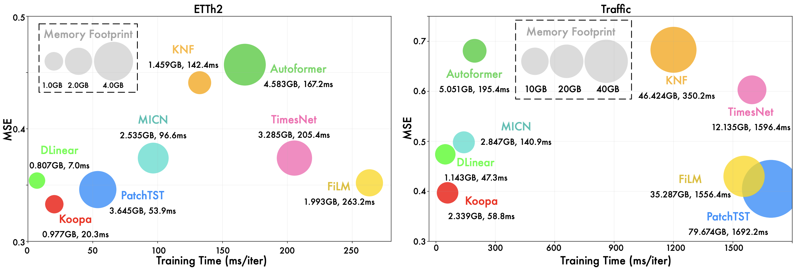
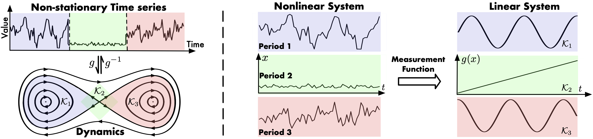
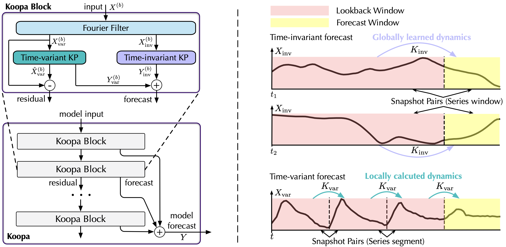
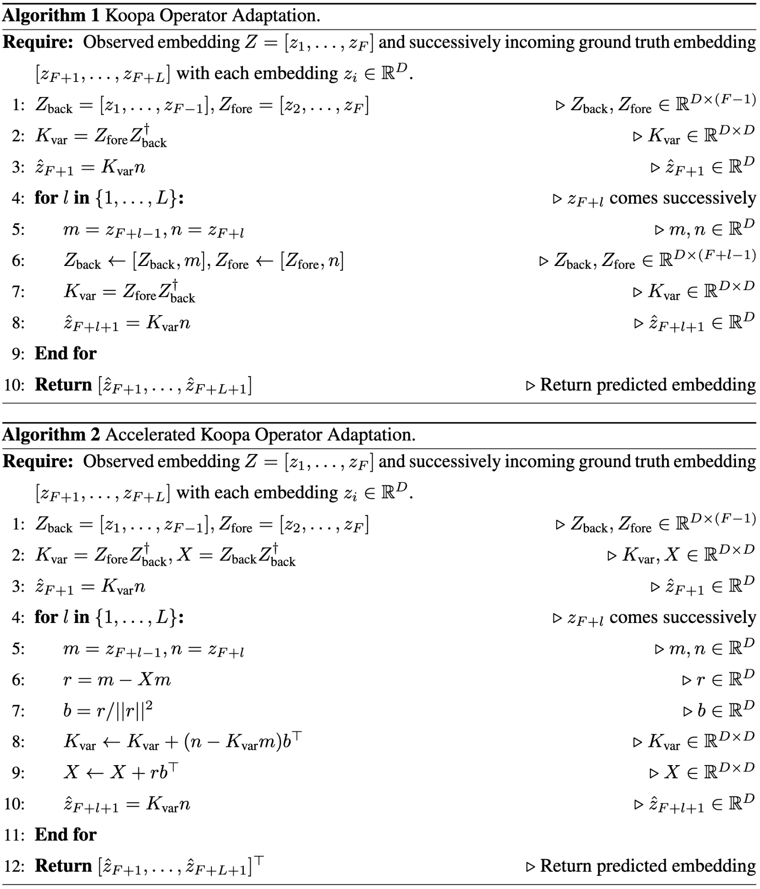

# Koopa

This is the official codebase for the paper: [Koopa: Learning Non-stationary Time Series Dynamics with Koopman Predictors](https://arxiv.org/pdf/2305.18803.pdf), NeurIPS 2023. 

## Updates

:triangular_flag_on_post: **News** (2023.10) Koopa has been included in [[Time-Series-Library]](https://github.com/thuml/Time-Series-Library).

## Introduction

Koopa is a **lightweight**, **MLP-based**, and **theory-inspired** model for efficient time series forecasting. 

- Compared with the advanced but painstakingly trained deep forecasters, Koopa achieves state-of-the-art performance while saving **77.3%** training time and **76.0%** memory footprint.

<p align="center">

</p>

- Focus on portraying ubiquitous **non-stationary** time series, Koopa shows **enhanced model capacity** empowered by the modern Koopman theory that naturally addresses the nonlinear evolution of real-world time series.
  
<p align="center">

</p>

- Koopa differs from the canonical Koopman Autoencoder without the reconstruction loss function to achieve **end-to-end predictive training**.
  
<p align="center">

</p>


## Discussions

There are already several discussions about our paper, we appreciate a lot for their valuable comments and efforts: [[Official]](https://mp.weixin.qq.com/s/10PoA6n51Qok-nJT6_vkhA), [[Openreview]](https://openreview.net/forum?id=jsanMaAxZE), [[Zhihu]](https://www.zhihu.com/question/24189178/answer/3064876852).


## Preparation

1. Install Pytorch (>=1.12.0) and other necessary dependencies.
```
pip install -r requirements.txt
```
2. All the six benchmark datasets can be obtained from [Google Drive](https://drive.google.com/file/d/1CC4ZrUD4EKncndzgy5PSTzOPSqcuyqqj/view?usp=sharing) or [Tsinghua Cloud](https://cloud.tsinghua.edu.cn/f/b8f4a78a39874ac9893e/?dl=1).

## Training scripts

We provide the Koopa experiment scripts and hyperparameters of all benchmark datasets under the folder `./scripts`.

```bash
bash ./scripts/ECL_script/Koopa.sh
bash ./scripts/Traffic_script/Koopa.sh
bash ./scripts/Weather_script/Koopa.sh
bash ./scripts/ILI_script/Koopa.sh
bash ./scripts/Exchange_script/Koopa.sh
bash ./scripts/ETT_script/Koopa.sh
```

## Applicable for Rolling Forecast

- By adapting the operator on the incoming time series during rolling forecast, the proposed model can achieve more accurate performance via adapting to continuous distribution shift.

- The naïve implementation of operator adaptation is based on the DMD algorithm. We propose an iterative algorithm with reduced complexity. The details can be found in the Appendix of our paper.


- We also provide a tutorial notebook for a better understanding of this scenario. See `operator_adaptation.ipynb` for the details.
<p align="center">

</p>


## Citation

If you find this repo useful, please cite our paper. 

```
@article{liu2023koopa,
  title={Koopa: Learning Non-stationary Time Series Dynamics with Koopman Predictors},
  author={Liu, Yong and Li, Chenyu and Wang, Jianmin and Long, Mingsheng},
  journal={arXiv preprint arXiv:2305.18803},
  year={2023}
}
```

## Contact

If you have any questions or want to use the code, please contact:
* liuyong21@mails.tsinghua.edu.cn
* lichenyu20@mails.tsinghua.edu.cn
