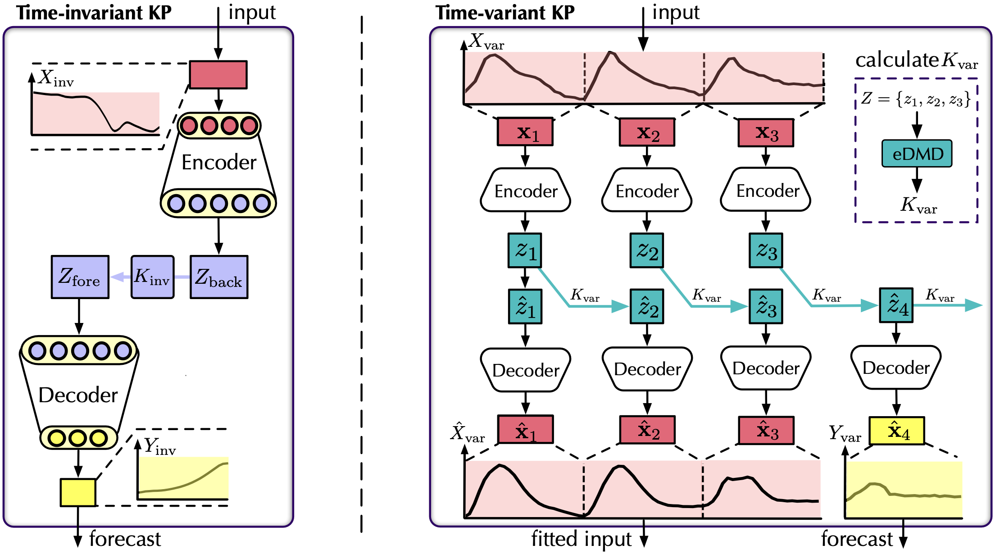
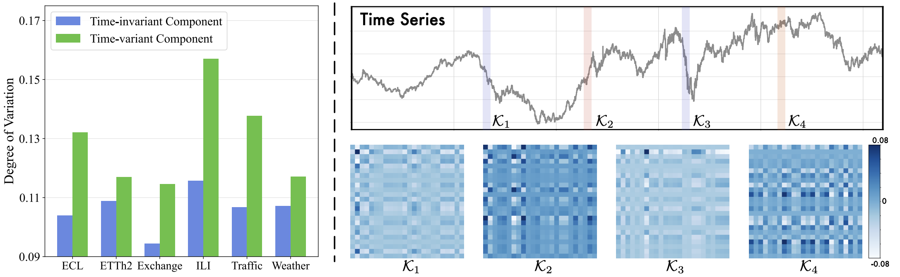

# Koopa

This is the codebase for the paper:
[Koopa: Learning Non-stationary Time Series Dynamics with Koopman Predictors](https://arxiv.org/pdf/2305.18803.pdf), arXiv preprint 2023.


## Architecture


## Koopman Predictors



## Preparation

1. Install Python 3.7 and neccessary dependencies.
```
pip install -r requirements.txt
```
2. All the six benchmark datasets can be obtained from [Google Drive](https://drive.google.com/file/d/1CC4ZrUD4EKncndzgy5PSTzOPSqcuyqqj/view?usp=sharing) or [Tsinghua Cloud](https://cloud.tsinghua.edu.cn/f/b8f4a78a39874ac9893e/?dl=1).

## Training scripts

We provide the Koopa experiment scripts and hyperparameters of all benchmark datasets under the folder `./scripts`.

```bash
bash ./scripts/ECL_script/Koopa.sh
bash ./scripts/Traffic_script/Koopa.sh
bash ./scripts/Weather_script/Koopa.sh
bash ./scripts/ILI_script/Koopa.sh
bash ./scripts/Exchange_script/Koopa.sh
bash ./scripts/ETT_script/Koopa.sh
```

## Interpretable Results



## Model Efficiency


## Citation

If you find this repo useful, please cite our paper. 

```
@article{liu2023koopa,
  title={Koopa: Learning Non-stationary Time Series Dynamics with Koopman Predictors},
  author={Liu, Yong and Li, Chenyu and Wang, Jianmin and Long, Mingsheng},
  journal={arXiv preprint arXiv:2305.18803},
  year={2023}
}
```

## Contact

If you have any questions or want to use the code, please contact:
* liuyong21@mails.tsinghua.edu.cn.
* lichenyu20@mails.tsinghua.edu.cn